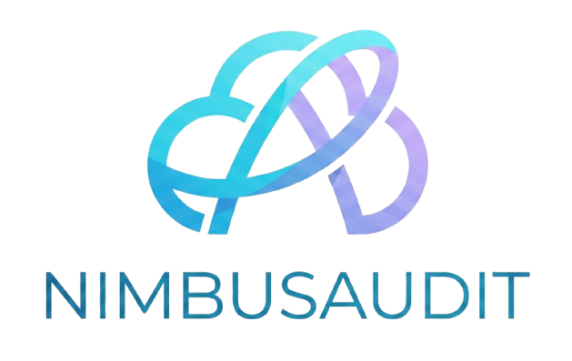

<p align="center">
  
</p>


# NimbusAudit

[](https://github.com/aahmedbaj/nimbusaudit/actions/workflows/tests.yml)

> See what your cloud forgot to secure.

NimbusAudit is a defensive, read-only AWS security auditing CLI that inspects cloud resource configurations and reports risky or unintended settings.

It helps answer questions like:

* Why is SSH publicly exposed?
* Which EC2 instances do not enforce IMDSv2?
* Are EBS volumes encrypted?
* Are S3 buckets protected from public access?
* Are S3 buckets using default encryption and AWS KMS where expected?

NimbusAudit is built for cloud administrators, security engineers, DevOps learners, and developers who want a lightweight way to review AWS security posture from the terminal.

---

## Overview

Cloud environments can grow quickly. Security groups, EC2 instances, EBS volumes, and S3 buckets may be created, modified, or forgotten during development, testing, migration, or scaling.

Manual review becomes tedious and error-prone.

NimbusAudit connects to an authorized AWS account using read-only permissions, inspects supported resources, and produces clear findings with:

* Severity level
* Affected resource
* Evidence
* Recommended remediation
* Security standards mappings where applicable

NimbusAudit currently focuses on AWS. Additional providers and infrastructure-as-code support are planned for later versions.

---

## Features

* Read-only AWS security auditing
* AWS profile and region support
* Persistent configuration with `nimbusaudit configure`
* Security group exposure checks
* EC2 IMDSv2 enforcement checks
* EBS encryption checks
* S3 public access and encryption checks
* Text and JSON reports
* Report output files with `--output-file`
* Selectable check groups with `--checks`
* Interactive scan menu with `nimbusaudit menu`
* Configurable failure threshold with `--fail-on`
* CI/CD-friendly exit codes
* Automated tests with pytest
* GitHub Actions CI workflow
* Containerized CLI execution with Docker
* Non-root container runtime
* Secure Docker runner using temporary least-privilege AWS credentials
* Persistent Docker report output through a bind-mounted `outputs/` directory

---

## Supported Checks

### Security Groups

| Rule ID          | Check                                                  | Severity   |
| ---------------- | ------------------------------------------------------ | ---------- |
| `AWS-EC2-SG-001` | SSH exposed to the public internet                     | `HIGH`     |
| `AWS-EC2-SG-002` | RDP exposed to the public internet                     | `HIGH`     |
| `AWS-EC2-SG-003` | MySQL exposed to the public internet                   | `HIGH`     |
| `AWS-EC2-SG-004` | PostgreSQL exposed to the public internet              | `HIGH`     |
| `AWS-EC2-SG-005` | All protocols and ports exposed to the public internet | `CRITICAL` |

### EC2

| Rule ID                | Check                                | Severity |
| ---------------------- | ------------------------------------ | -------- |
| `AWS-EC2-INSTANCE-001` | EC2 instance does not enforce IMDSv2 | `HIGH`   |

### EBS

| Rule ID           | Check                       | Severity |
| ----------------- | --------------------------- | -------- |
| `AWS-EC2-EBS-001` | EBS volume is not encrypted | `HIGH`   |

### S3

| Rule ID             | Check                                             | Severity |
| ------------------- | ------------------------------------------------- | -------- |
| `AWS-S3-BUCKET-001` | S3 bucket does not fully block public access      | `HIGH`   |
| `AWS-S3-BUCKET-002` | S3 bucket default encryption is not enabled       | `HIGH`   |
| `AWS-S3-BUCKET-003` | S3 bucket default encryption does not use AWS KMS | `MEDIUM` |

---

## Out of Scope

NimbusAudit does not include:

* Automatic remediation
* Resource creation, modification, or deletion
* Exploitation or active attacks
* Network penetration testing
* A web dashboard
* Complete coverage of every AWS service
* Oracle Cloud Infrastructure support
* Terraform static analysis
* Scanning accounts without explicit authorization

---

## Local Installation

Clone the repository:

```bash
git clone https://github.com/aahmedbaj/nimbusaudit.git
cd nimbusaudit
```

Create and activate a virtual environment:

```bash
python -m venv .venv
source .venv/bin/activate
```

Install the project:

```bash
python -m pip install --upgrade pip
python -m pip install -e ".[dev]"
```

Run tests:

```bash
pytest
```

---

## AWS Credentials

NimbusAudit uses authorized AWS credentials and should be run with least-privilege permissions, not an administrator identity.

For local execution, authenticate the AWS profile used by NimbusAudit according to your AWS CLI setup.

For example, with AWS CLI login:

```bash
aws login --profile <source-profile>
```

A recommended setup is to use a dedicated AWS CLI profile that assumes a least-privilege NimbusAudit IAM role.

Conceptually:

```text
authorized source identity
        ↓
STS AssumeRole
        ↓
NimbusAuditReadOnlyRole
        ↓
temporary restricted credentials
        ↓
NimbusAudit
```

For Docker execution, NimbusAudit does **not** mount the host `~/.aws` directory into the container.

Instead, the provided `scripts/run-docker.sh` wrapper lets the host AWS CLI resolve or refresh authentication, assume the least-privilege role, export one temporary STS credential set, and mount only that temporary credentials file into the container as read-only.

This keeps the host AWS login cache, source profile, refresh state, and other AWS profiles outside the container.

---

## Docker

NimbusAudit can run as the same CLI inside a Docker container.

### Build the Image

From the repository root:

```bash
docker build -t nimbusaudit .
```

Verify the CLI:

```bash
docker run --rm nimbusaudit --help
```

Running the image without additional arguments also displays help:

```bash
docker run --rm nimbusaudit
```

The image runs NimbusAudit as a non-root Linux user.

### Recommended AWS Workflow

For AWS scans, use:

```text
scripts/run-docker.sh
```

instead of bind-mounting the entire host `~/.aws` directory.

The wrapper performs the credential handoff on the host:

```text
host AWS login/profile
        ↓
resolve effective NimbusAudit profile
        ↓
resolve or refresh authentication
        ↓
assume NimbusAuditReadOnlyRole when applicable
        ↓
export temporary STS credentials
        ↓
create a private temporary credentials file
        ↓
mount that single file read-only into Docker
        ↓
run NimbusAudit
        ↓
delete the temporary credential file
```

The container receives only the temporary credentials supplied for the NimbusAudit scan.

It does **not** receive:

* The host `~/.aws` directory
* The source or administrator profile configuration
* AWS login cache files
* Login refresh state
* Other AWS profiles
* Persistent AWS access keys

A role-based AWS CLI profile can look like:

```ini
[profile nimbusaudit-readonly]
role_arn = arn:aws:iam::<account-id>:role/NimbusAuditReadOnlyRole
source_profile = <source-profile>
region = eu-central-1
role_session_name = nimbusaudit-local
```

The source identity must be trusted by `NimbusAuditReadOnlyRole` to perform `sts:AssumeRole`.

Verify role assumption on the host:

```bash
aws sts get-caller-identity \
  --profile nimbusaudit-readonly
```

The returned ARN should identify an assumed role, for example:

```text
arn:aws:sts::<account-id>:assumed-role/NimbusAuditReadOnlyRole/nimbusaudit-local
```

### Docker Configuration

Dockerized NimbusAudit reuses the same persistent configuration as the local CLI:

```text
~/.config/nimbusaudit/config.json
```

The wrapper bind-mounts the NimbusAudit configuration directory into the container, so configuration changes made through Docker persist on the host.

Run the interactive configuration command with:

```bash
./scripts/run-docker.sh configure
```

You can also configure values non-interactively:

```bash
./scripts/run-docker.sh configure \
  --profile nimbusaudit-readonly \
  --region eu-central-1 \
  --format json
```

The updated configuration is written to the same host file used by the local CLI:

```text
~/.config/nimbusaudit/config.json
```

The container itself remains ephemeral. The configuration persists because the host configuration directory is bind-mounted read/write.

### AWS Profile Resolution

For Docker scans, the wrapper resolves the AWS profile using this precedence:

```text
explicit --profile
        ↓ if absent
profile saved in ~/.config/nimbusaudit/config.json
        ↓ if absent
nimbusaudit-readonly
```

For example:

```bash
./scripts/run-docker.sh \
  --profile nimbusaudit-readonly \
  --region eu-central-1
```

uses the explicitly supplied profile for that run.

If `--profile` is omitted, the wrapper uses the profile saved by `nimbusaudit configure`.

If no saved profile exists, it falls back to:

```text
nimbusaudit-readonly
```

An explicitly requested invalid profile causes the wrapper to fail instead of silently falling back to another AWS identity.

The resolved profile is used both:

* by the host AWS CLI when exporting temporary credentials
* by NimbusAudit inside the container

This keeps the host credential identity and container scan identity synchronized.

### Run a Dockerized Scan

Make the wrapper executable once:

```bash
chmod +x scripts/run-docker.sh
```

Then run NimbusAudit:

```bash
./scripts/run-docker.sh \
  --region eu-central-1
```

NimbusAudit arguments are passed through the wrapper while Docker-specific details such as credential mounts and output mounts are handled automatically.

A dedicated least-privilege AWS profile such as `nimbusaudit-readonly` is recommended.

### Interactive Menu

The wrapper supports NimbusAudit's interactive menu:

```bash
./scripts/run-docker.sh menu
```

The wrapper automatically starts Docker with an interactive terminal for `menu`.

Global NimbusAudit options must appear **before** the `menu` subcommand.

Correct:

```bash
./scripts/run-docker.sh \
  --region eu-central-1 \
  --format json \
  --output-file report.json \
  menu
```

Incorrect:

```bash
./scripts/run-docker.sh menu \
  --region eu-central-1 \
  --output-file report.json
```

This follows NimbusAudit's CLI structure: global options belong to the top-level command, while `menu` is a subcommand.

The container is still started with `--rm`, so it is automatically removed after the interactive session finishes.

### Override the Docker Image

The wrapper uses:

```text
nimbusaudit
```

by default.

Override it with:

```bash
NIMBUSAUDIT_IMAGE=<image> \
./scripts/run-docker.sh \
  --region eu-central-1
```

### Save Docker Reports to the Host

NimbusAudit writes relative report paths into its `outputs/` directory.

The Docker wrapper bind-mounts the host directory:

```text
<ProjectRoot>/outputs
```

to NimbusAudit's runtime output directory inside the container:

```text
/app/outputs
```

For example:

```bash
./scripts/run-docker.sh \
  --format json \
  --output-file report.json
```

NimbusAudit resolves the relative filename to:

```text
outputs/report.json
```

inside its working directory.

Because `/app/outputs` is bind-mounted, the report persists on the host at:

```text
outputs/report.json
```

If no extension is provided:

```bash
./scripts/run-docker.sh \
  --format text \
  --output-file report
```

NimbusAudit adds the appropriate extension and writes:

```text
outputs/report.txt
```

The output directory is intentionally mounted read/write so generated reports persist after the container exits.

The AWS credential file remains mounted read-only.

### Docker Credential Boundary

The wrapper resolves the effective AWS profile and exports credentials on the host with the equivalent of:

```bash
aws configure export-credentials \
  --profile <resolved-profile> \
  --format env
```

The host AWS CLI is responsible for:

* Resolving the source profile
* Refreshing host authentication when necessary
* Assuming the NimbusAudit IAM role when applicable
* Obtaining temporary credentials

Only the resulting temporary credential set is written to a private temporary file.

Inside the container, the wrapper sets:

```text
AWS_SHARED_CREDENTIALS_FILE=/run/nimbusaudit/aws-credentials
```

This tells Boto3 where to find the temporary shared credentials file.

It does not redirect or expose the host `~/.aws` directory.

The temporary credential file is mounted into the container as read-only and deleted by the wrapper after execution.

### Docker Exit Codes

The wrapper preserves NimbusAudit's normal exit-code semantics:

| Exit code | Meaning                                                                                                 |
| --------: | ------------------------------------------------------------------------------------------------------- |
|       `0` | Scan completed successfully and no findings met the configured failure threshold.                       |
|       `1` | Scan completed successfully, but one or more findings met or exceeded the configured failure threshold. |
|       `2` | NimbusAudit could not complete because of input, configuration, AWS, output, or wrapper setup errors.   |

Docker treats any non-zero process exit status generically as a failed container command.

For NimbusAudit, exit code `1` does **not** mean the scan failed to execute. It means the scan completed successfully and detected findings that met the configured failure threshold.

---

## Required AWS Permissions

NimbusAudit is designed as a read-only security auditing tool.

The repository includes a reference IAM policy:

[`docs/nimbusaudit-readonly-policy.json`](docs/nimbusaudit-readonly-policy.json)

The current scanners require:

```text
ec2:DescribeSecurityGroups
ec2:DescribeInstances
ec2:DescribeVolumes
s3:ListAllMyBuckets
s3:GetBucketPublicAccessBlock
s3:GetEncryptionConfiguration
```

Example policy:

```json
{
  "Version": "2012-10-17",
  "Statement": [
    {
      "Sid": "NimbusAuditEC2ReadOnly",
      "Effect": "Allow",
      "Action": [
        "ec2:DescribeSecurityGroups",
        "ec2:DescribeInstances",
        "ec2:DescribeVolumes"
      ],
      "Resource": "*"
    },
    {
      "Sid": "NimbusAuditS3ReadOnly",
      "Effect": "Allow",
      "Action": [
        "s3:ListAllMyBuckets",
        "s3:GetBucketPublicAccessBlock",
        "s3:GetEncryptionConfiguration"
      ],
      "Resource": "*"
    }
  ]
}
```

The `"Resource": "*"` value does not grant unrestricted AWS access. It applies only to the listed read-only API actions. Some AWS read/list APIs do not support restricting access to individual resources.

The policy file is a reference template. Adding it to the repository does not automatically create an IAM policy, IAM role, or AWS CLI profile.

Recommended setup:

```text
IAM policy document
        ↓ attached to
NimbusAuditReadOnlyRole
        ↓ assumed through
nimbusaudit-readonly AWS profile
        ↓ used by
NimbusAudit
```

The role trust policy determines **who can assume the role**, while the NimbusAudit permissions policy determines **what the assumed role can do**.

---

## Configuration

Configure NimbusAudit interactively:

```bash
nimbusaudit configure
```

Or configure values non-interactively:

```bash
nimbusaudit configure \
  --profile nimbusaudit-readonly \
  --region eu-central-1 \
  --format text
```

Once configured, run:

```bash
nimbusaudit
```

Command-line options can still be used as temporary overrides:

```bash
nimbusaudit --region us-east-1 --format json
```

Temporary overrides do not modify the saved NimbusAudit configuration.

---

## Usage

Run all checks using the saved configuration:

```bash
nimbusaudit
```

Run with a specific AWS profile and region:

```bash
nimbusaudit --profile nimbusaudit-readonly --region eu-central-1
```

Print JSON output:

```bash
nimbusaudit --format json
```

Run only S3 checks:

```bash
nimbusaudit --checks s3
```

Run selected check groups:

```bash
nimbusaudit --checks security-groups,s3
```

Run with a custom failure threshold:

```bash
nimbusaudit --fail-on medium
```

Save a report to a file:

```bash
nimbusaudit --format json --output-file report.json
```

---

## Selecting Check Groups

By default, NimbusAudit runs all available check groups:

```bash
nimbusaudit
```

You can run a specific check group with `--checks`:

```bash
nimbusaudit --checks security-groups
```

```bash
nimbusaudit --checks ec2
```

```bash
nimbusaudit --checks ebs
```

```bash
nimbusaudit --checks s3
```

You can also run multiple groups by separating them with commas:

```bash
nimbusaudit --checks security-groups,s3
```

To explicitly run every available group:

```bash
nimbusaudit --checks all
```

Available check groups:

```text
security-groups
ec2
ebs
s3
```

The `all` option cannot be combined with other groups.

---

## Interactive Menu

NimbusAudit includes an optional interactive menu:

```bash
nimbusaudit menu
```

The menu lets you select check groups without remembering the `--checks` syntax.

Example menu:

```text
NimbusAudit menu
========================================================================

Select check groups to run:

  0. exit
  1. security-groups
  2. ec2
  3. ebs
  4. s3
  *. all

Enter one option or multiple check numbers separated by commas.
Examples: 1,4 or *
```

Examples:

```text
1
```

Runs only security-group checks.

```text
1,4
```

Runs security-group and S3 checks.

```text
*
```

Runs all checks.

```text
0
```

Exits without starting a scan.

The menu is intended for interactive use. For automation and CI/CD, prefer direct CLI flags such as:

```bash
nimbusaudit --checks security-groups,s3
```

---

## Saving Reports to a File

NimbusAudit can print reports to stdout or write them to a file.

Print JSON to stdout:

```bash
nimbusaudit --format json
```

Write JSON to a file:

```bash
nimbusaudit --format json --output-file report.json
```

If the output file has no extension, NimbusAudit adds the extension that matches the selected output format:

```bash
nimbusaudit --format json --output-file report
```

This writes:

```text
outputs/report.json
```

For text output:

```bash
nimbusaudit --format text --output-file report
```

This writes:

```text
outputs/report.txt
```

If a file extension is provided, it must match the selected format. For example, this is rejected:

```bash
nimbusaudit --format json --output-file report.txt
```

NimbusAudit returns exit code `2` when the output file path is invalid or cannot be written.

---

## Configuring Failure Threshold

NimbusAudit returns exit code `1` when findings meet or exceed the configured failure threshold.

By default, NimbusAudit fails on `HIGH` and `CRITICAL` findings:

```bash
nimbusaudit
```

This is equivalent to:

```bash
nimbusaudit --fail-on high
```

You can make the scan less strict and fail only on critical findings:

```bash
nimbusaudit --fail-on critical
```

Or make it stricter:

```bash
nimbusaudit --fail-on medium
```

```bash
nimbusaudit --fail-on low
```

Severity order:

```text
LOW < MEDIUM < HIGH < CRITICAL
```

Failure behavior:

| Option               | Returns exit code `1` when findings include |
| -------------------- | ------------------------------------------- |
| `--fail-on critical` | `CRITICAL`                                  |
| `--fail-on high`     | `HIGH`, `CRITICAL`                          |
| `--fail-on medium`   | `MEDIUM`, `HIGH`, `CRITICAL`                |
| `--fail-on low`      | `LOW`, `MEDIUM`, `HIGH`, `CRITICAL`         |

---

## Exit Codes

NimbusAudit uses exit codes suitable for shell scripting and CI/CD pipelines.

| Exit code | Meaning                                                                                                      |
| --------: | ------------------------------------------------------------------------------------------------------------ |
|       `0` | Scan completed successfully and no findings met the configured failure threshold.                            |
|       `1` | Scan completed successfully, but one or more findings met or exceeded the configured failure threshold.      |
|       `2` | NimbusAudit could not complete because of invalid input, configuration issues, AWS errors, or output errors. |

In interactive menu mode, selecting `0` exits safely with code `0`.

Invalid menu input returns code `2`.

---

## Example Output

```text
                           NimbusAudit report
========================================================================
Profile: nimbusaudit-readonly
Region: eu-central-1

Checks run
----------
  - security-groups
  - ec2
  - ebs
  - s3

Resources scanned
-----------------
  Security groups : 5
  EC2 instances   : 2
  EBS volumes     : 2
  S3 buckets      : 1

Findings summary
----------------
  Critical : 0
  High     : 2
  Medium   : 1
  Low      : 0
  Total    : 3

Findings
--------

[HIGH] SSH exposed to the public internet
  Rule: AWS-EC2-SG-001
  Resource: sg-xxxxxxxxxxxxxxxxx
  Evidence: Security group 'web-sg' allows TCP port 22 from 0.0.0.0/0.
  Remediation: Restrict SSH access to an approved admin IP, corporate VPN, bastion host, or Systems Manager Session Manager.

[HIGH] S3 bucket does not fully block public access
  Rule: AWS-S3-BUCKET-001
  Resource: example-bucket
  Evidence: S3 bucket 'example-bucket' does not have all public access block settings enabled.
  Remediation: Enable S3 Block Public Access settings for the bucket.

[MEDIUM] S3 bucket default encryption does not use AWS KMS
  Rule: AWS-S3-BUCKET-003
  Resource: example-bucket
  Evidence: S3 bucket 'example-bucket' uses default encryption algorithm(s): AES256. AWS KMS encryption was not detected.
  Remediation: Configure default server-side encryption with AWS KMS using SSE-KMS or DSSE-KMS when stronger key management, auditability, or compliance alignment is required.
```

---

## JSON Output

NimbusAudit can also produce JSON reports for automation:

```bash
nimbusaudit --format json
```

Example structure:

```json
{
  "profile": "nimbusaudit-readonly",
  "region": "eu-central-1",
  "checks_run": [
    "security-groups",
    "ec2",
    "ebs",
    "s3"
  ],
  "security_groups_scanned": 5,
  "ec2_instances_scanned": 2,
  "ebs_volumes_scanned": 2,
  "s3_buckets_scanned": 1,
  "findings_count": 3,
  "severity_counts": {
    "CRITICAL": 0,
    "HIGH": 2,
    "MEDIUM": 1,
    "LOW": 0
  },
  "findings": []
}
```

---

## Terraform Demo Lab

NimbusAudit includes a Terraform-based AWS demo lab under:

```text
terraform/aws-lab
```

The lab creates intentionally misconfigured AWS resources so NimbusAudit can produce predictable findings.

The lab currently includes:

* VPC
* Public subnet
* Internet gateway
* Public route table
* Security group with SSH open to `0.0.0.0/0`
* EC2 instance with IMDSv2 not enforced
* Root EBS volume encryption test case
* S3 bucket with incomplete Block Public Access configuration
* S3 bucket using SSE-S3 encryption instead of AWS KMS

Deploy the lab:

```bash
cd terraform/aws-lab
terraform init
terraform plan \
  -var="aws_profile=<your-profile>" \
  -var="aws_region=eu-central-1"
terraform apply \
  -var="aws_profile=<your-profile>" \
  -var="aws_region=eu-central-1"
```

Run NimbusAudit against the lab:

```bash
cd ../..
nimbusaudit \
  --profile <your-profile> \
  --region eu-central-1 \
  --checks security-groups,ec2,ebs,s3
```

Destroy the lab after testing:

```bash
cd terraform/aws-lab
terraform destroy \
  -var="aws_profile=<your-profile>" \
  -var="aws_region=eu-central-1"
```

This lab is intended for controlled security testing only. Do not deploy it in a production AWS account.

---

## Development

Install development dependencies:

```bash
python -m pip install -e ".[dev]"
```

Run all tests:

```bash
pytest
```

Run a specific test file:

```bash
pytest tests/test_s3.py -v
```

Compile source files:

```bash
python -m compileall src
```

The project uses GitHub Actions to run the test suite automatically on pushes and pull requests.

---

## Project Status

NimbusAudit `v0.1.0` introduced the AWS scanner.

NimbusAudit `v0.2.0` added a Terraform-based AWS lab for reproducible demonstrations.

Docker support is being added for `v0.3.0`.

The current development version can:

* Authenticate using an authorized AWS profile
* Persist a default AWS profile, region, and output format
* Retrieve supported AWS resources through Boto3
* Detect public IPv4 and IPv6 security-group exposure
* Detect publicly exposed SSH, RDP, MySQL, and PostgreSQL ports
* Detect security groups that expose all protocols and ports
* Detect EC2 instances that do not enforce IMDSv2
* Detect unencrypted EBS volumes
* Inspect S3 bucket Block Public Access configuration
* Detect S3 buckets whose Block Public Access configuration is missing or not fully enabled
* Detect S3 buckets without default encryption
* Detect S3 buckets whose default encryption does not use AWS KMS
* Run all checks or selected check groups
* Provide an optional interactive check-selection menu
* Produce text or JSON reports
* Write reports to output files
* Return exit codes suitable for scripting and CI/CD workflows
* Apply a configurable finding-severity failure threshold
* Serialize findings with severity, evidence, remediation, and standards mappings
* Run automated tests through GitHub Actions
* Include a Terraform AWS lab for reproducible demos
* Create intentionally vulnerable AWS resources for controlled testing
* Document the apply → scan → destroy workflow
* Build and run NimbusAudit as a Dockerized CLI
* Run the container as a non-root user
* Keep Docker containers ephemeral while persisting NimbusAudit configuration and reports on the host
* Reuse `~/.config/nimbusaudit/config.json` across local and Docker execution
* Support interactive `menu` and `configure` commands through the Docker wrapper
* Resolve AWS profile precedence as CLI override → saved configuration → `nimbusaudit-readonly`
* Resolve and export temporary AWS credentials on the host for Docker scans
* Mount only the temporary credential file into the container as read-only
* Keep the host AWS identity store outside the container
* Persist Docker reports through the bind-mounted NimbusAudit outputs/ directory
* Preserve NimbusAudit exit-code semantics through the Docker wrapper
* Validate Docker image builds and CLI startup through GitHub Actions
* Keep the runtime image minimal through explicit source copying and Docker build-context exclusions

---

## Roadmap

Planned future work:

* Add more AWS checks, such as IAM, CloudTrail, RDS, and Lambda
* Add Terraform static analysis for selected AWS misconfigurations
* Improve report formatting and summaries
* Explore Oracle Cloud Infrastructure support through a provider-based architecture

---

## Security Notice

NimbusAudit is intended for defensive security auditing only.

Use it only with AWS accounts and resources you own or are authorized to assess.

NimbusAudit does not exploit resources, modify cloud configurations, or perform active attacks.

For Dockerized AWS scans, the recommended workflow provides two separate security boundaries:

* **Docker/filesystem boundary:** the container does not receive the host `~/.aws` identity store.
* **AWS/IAM boundary:** the credentials deliberately supplied to the container belong to a dedicated least-privilege NimbusAudit role.

---

## License

This project is licensed under the MIT License.
